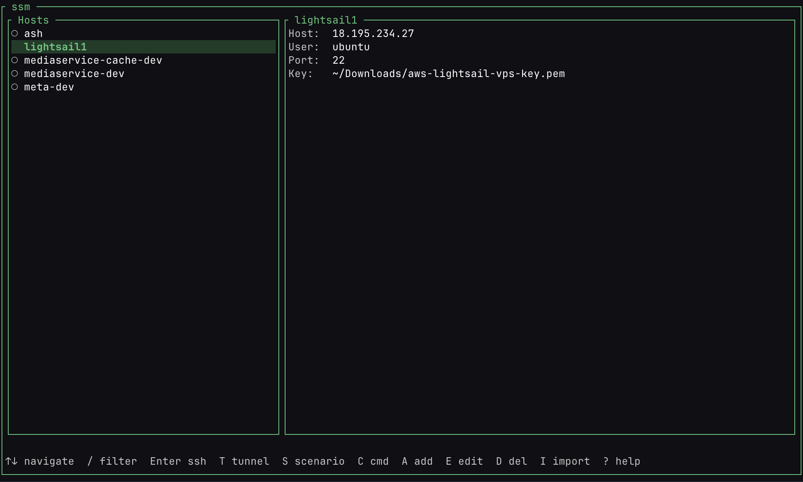

<div align="center">

# ssm

**Fast TUI for managing SSH connections, tunnels, and per-host commands.**

[](https://crates.io/crates/ssm)
[](LICENSE)
[](https://github.com/isolonenko/ssm/actions)



</div>

No more scattered shell aliases, forgotten port numbers, or grepping `ps aux` for tunnel PIDs. `ssm` gives you a single place to store hosts, spin up tunnels, and run commands — with aliases that work system-wide.

## Install

**From source:**

```bash
cargo install --path crates/ssm
```

**From crates.io:**

```bash
cargo install ssm
```

## What it does

**Manage hosts** — Add, edit, delete SSH hosts through a step-by-step wizard. Hosts are stored in `~/.config/ssm/config.toml` and automatically synced to `~/.ssh/ssm-hosts.conf`, so aliases like `ssh prod-api` work everywhere — not just inside ssm.

**Run tunnels** — Start and stop SSH tunnels per host. Tunnels run as background processes and survive app restarts. Status indicators show what's running at a glance.

**Scenarios** — Group tunnels across multiple hosts into named scenarios. Start your entire dev environment with one keypress instead of running 10 separate `ssh -L` commands.

**Import tunnels** — Paste existing `ssh -L` commands and ssm parses them, groups by host, and creates the tunnel configs automatically. Existing hosts get matched by hostname.

**Per-host commands** — Save diagnostic commands (logs, status checks, disk usage) scoped to each host. Run them inline or in a new terminal session.

**Terminal-aware** — Detects tmux, zellij, iTerm2, kitty, WezTerm, and others. SSH sessions open in a split pane or new tab when possible, keeping ssm running alongside.

**Filter and tags** — Fuzzy search by alias, hostname, or tags. Use `tag:prod` to filter by tag.

## Keybindings

| Key | Action |
|-----|--------|
| `j/k` or `↑/↓` | Navigate host list |
| `/` | Filter hosts |
| `Enter` | SSH into selected host |
| `t` | Tunnel menu (or add tunnel if none exist) |
| `Shift+T` | Toggle all tunnels for a host |
| `s` | Scenarios menu |
| `c` | Command picker |
| `i` | Import tunnels from pasted SSH commands |
| `a` | Add new host |
| `e` | Edit selected host |
| `d` | Delete selected host |
| `?` | Help |
| `q` | Quit |

## CLI

Tunnels can also be managed without the TUI:

```bash
ssm tunnel start prod-api postgres   # start a specific tunnel
ssm tunnel stop prod-api             # stop all tunnels for a host
ssm tunnel status                    # list all running tunnels
```

## Config

Everything lives in `~/.config/ssm/config.toml`:

```toml
[[hosts]]
alias = "prod-api"
hostname = "10.0.1.50"
user = "deploy"
port = 22
identity_file = "~/.ssh/id_ed25519"
tags = ["prod", "api"]

[[hosts.tunnels]]
name = "postgres"
local_port = 5432
remote_host = "localhost"
remote_port = 5432

[[hosts.commands]]
name = "logs"
command = "tail -f /var/log/app/api.log"

[[scenarios]]
name = "dev-env"

[[scenarios.tunnels]]
host = "prod-api"
tunnel = "postgres"
```

On first run, ssm imports hosts from your existing `~/.ssh/config`.

## How it works

- Hosts are stored in TOML, not in `~/.ssh/config` directly
- A generated `~/.ssh/ssm-hosts.conf` is included via `Include` in your SSH config
- Tunnels run as detached `ssh -N -L` processes, tracked by PID in `~/.config/ssm/tunnels.json`
- Tunnel processes survive app exit and are reconciled on next launch

## License

MIT
